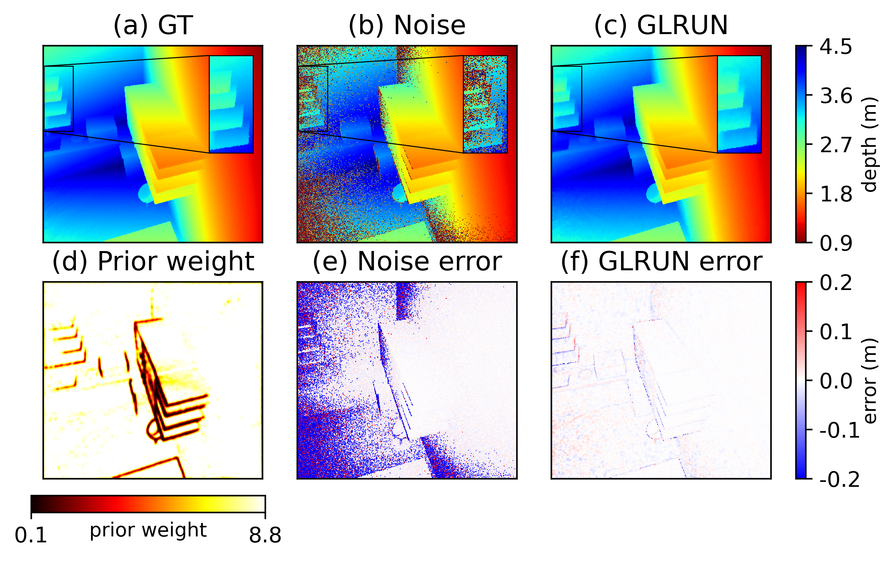

# GLRUN: Graph Laplacian Regularization Unrolling Network
A PyTorch implementation of Depth Denoising with Confidence-Aware Diffusion model. Original work: [Jia et al.]("https://ieeexplore.ieee.org/abstract/document/10878265")\

## Environment Setup
### Clone this directory
```
git clone https://github.com/BadbeardHe/GLRUN.git
```
### Install Dependencies
Ensure your environment has Python 3.9 or later installed. Use the following command to install required dependencies:
```
pip install -r requirements.txt
```

## Dataset Preparation
Download [FLAT dataset](https://github.com/NVlabs/FLAT.git). 


## Basic Usage
### Training
Run the following command to start model training:
```
python -u train.py \
    -lr 2.5e-3 \
    --weight_decay 1e-5 \
    -in "/Path/to/FLAT/dir" \
    -out "/Path/to/trained/GLRUN/model" \
    -d "/Path/to/predicted/Depth" \
    -e 200
```

### Inferencing
Run the following command to inference a single scene:
```
python predict.py \
    -in "/Path/to/noise/IQ" \
    -ls "/Path/to/test/list" \
    -out "/Path/to/predicted/IQ" \
    -out_mu "/Path/to/predicted/mu" \
    -out_d "/Path/to/predicted/Depth" \
    -m "/Path/to/trained/GLRUN/model" \
```

### Evaluation
Evaluate trained model using the command:
```
python eval.py \
   -in "/Path/to/predicted/depth" \
   -gt "/Path/to/ideal/depth" \
   -out "/Path/to/result/dir" \
   -v "Version"
```

# References
If you find this repository useful for your research, please cite the following work.
```
@article{jia2025deep,
  title={Deep Unrolled Graph Laplacian Regularization for Robust Time-of-Flight Depth Denoising},
  author={Jia, Jingwei and He, Changyong and Wang, Jianhui and Cheung, Gene and Zeng, Jin},
  journal={IEEE Signal Processing Letters},
  year={2025},
  publisher={IEEE}
}
```